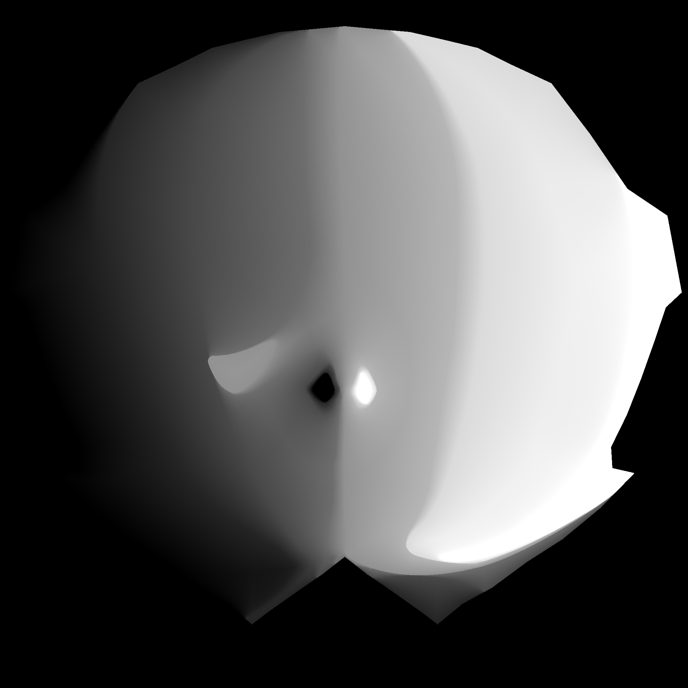
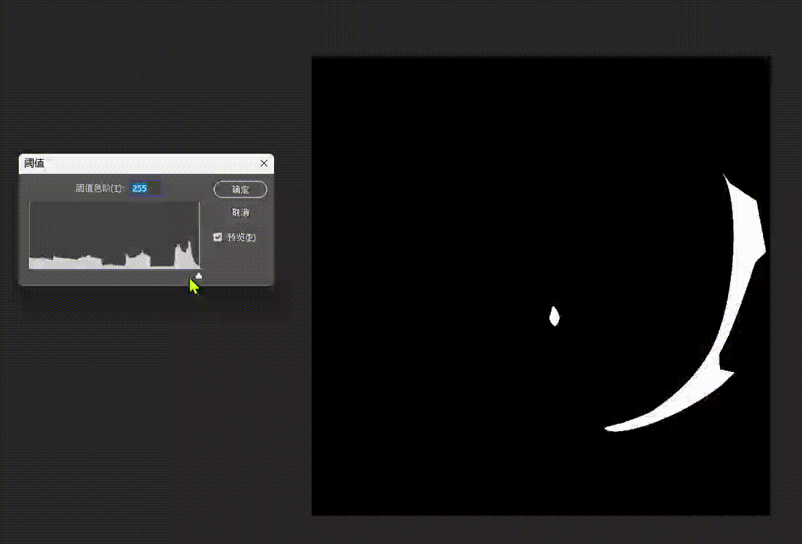

# generateSDF
## 简介
generateSDF是一个使用Golang编写的命令行工具，用于生成SDF（Signed Distance Field）图片，以及混合SDF图片形成动画效果。SDF是一种用于描述2D和3D形状的数学函数，它可以描述形状的边界和内部。
主要使用的算法是8SSEDT, 8SSEDT算法的原理可以参考[这里](http://www.codersnotes.com/notes/signed-distance-fields/)

## 命令说明
### 生成SDF图片

```bash
# 指定图片生成
go run sdf.go gen example/a.png

# 通配符方式批量生成
go run sdf.go gen example/*.png

# 指定输出目录
go run sdf.go gen -o output example/*.png
```

### 合并混合SDF图片
合并的图片需要成对，不能只有单数
```bash
# 合并两张SDF图片
go run sdf.go blend sdf_output/a.png sdf_output/b.png

# 合并多张SDF图片
go run sdf.go blend sdf_output/*.png

# 指定输出目录和图片名称
go run sdf.go blend -o output/blend.png sdf_output/*.png
```

## 生成效果
使用example文件夹下的图片生成的效果如下：


使用PS的阈值查看，拉动滑块可以看到效果：

